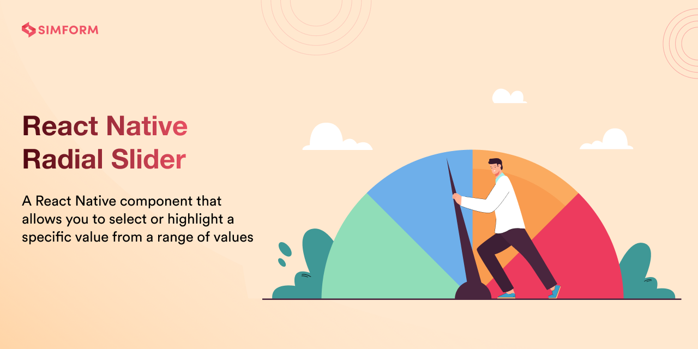

# react-native-radial-input-slider

[](https://www.npmjs.com/package/react-native-radial-input-slider) [](https://www.npmtrends.com/react-native-radial-input-slider) [](https://packagephobia.com/result?p=react-native-radial-input-slider)

---

## About

`react-native-radial-input-slider` is a React Native component that provides a radial slider with an integrated input field for direct value entry. It allows users to select a specific value using a circular slider while also offering a text input for precise adjustments.

### Features:

✅ **Radial Slider:** Smooth, circular value selection.
✅ **Direct Input:** Users can enter values manually.
✅ **Customizable:** Modify colors, sizes, and behaviors.
✅ **Dynamic Updates:** Syncs values instantly.
✅ **Ideal for Transactions:** Perfect for selecting amounts, budgets, or other numerical inputs.

---

## 🎬 Preview

| Radial Input Slider |
|---------------------|
|  |

---

## Installation

```sh
npm install react-native-radial-input-slider react-native-svg
# or
yarn add react-native-radial-input-slider react-native-svg
```

For iOS, run:

```sh
cd ios && pod install
```

---

## Usage

```jsx
import React, { useState } from 'react';
import { StyleSheet, View } from 'react-native';
import { RadialInputSlider } from 'react-native-radial-input-slider';

const Example = () => {
  const [value, setValue] = useState(50);

  return (
    <View style={styles.container}>
      <RadialInputSlider value={value} min={0} max={100} onChange={setValue} />
    </View>
  );
};

const styles = StyleSheet.create({
  container: {
    flex: 1,
    justifyContent: 'center',
  },
});

export default Example;
```

---

## Properties

| Prop                  | Default                                                                    | Type           | Description                                                                              | RadialSlider | SpeedoMeter |
| :-------------------- | :------------------------------------------------------------------------- | :------------- | :--------------------------------------------------------------------------------------- | ------------ | ----------- |
| **min\***             | 0                                                                          | number         | Minimum value                                                                            | ✅           | ✅          |
| **max\***             | 100                                                                        | number         | Maximum value                                                                            | ✅           | ✅          |
| **value\***           | 0                                                                          | number         | Show selection upto this value                                                           | ✅           | ✅          |
| **onChange\***        | -                                                                          | function       | Callback function that invokes on change in track                                        | ✅           | ✅          |
| radius                | 100                                                                        | number         | Size of component                                                                        | ✅           | ✅          |
| startAngle            | 270                                                                        | number [1-360] | The angle at which the circular slider should start from.                                | ✅           | ❌          |
| step                  | 1                                                                          | number         | Step value for component                                                                 | ✅           | ❌          |
| markerValue           | -                                                                          | number         | Show marker on specific number                                                           | ✅           | ✅          |
| title                 | -                                                                          | string         | Title for component                                                                      | ✅           | ❌          |
| subTitle              | Goal                                                                       | string         | Subtitle for component                                                                   | ✅           | ❌          |
| unit                  | RadialSlider: 'kCal', SpeedoMeter: 'MB/S'                                  | string         | Unit for component                                                                       | ✅           | ✅          |
| thumbRadius           | 18                                                                         | number         | Radius for thumb                                                                         | ✅           | ❌          |
| thumbColor            | #008ABC                                                                    | string         | Color for thumb                                                                          | ✅           | ❌          |
| thumbBorderWidth      | 5                                                                          | number         | Width for thumb                                                                          | ✅           | ❌          |
| thumbBorderColor      | #FFFFFF                                                                    | string         | Border Color for thumb                                                                   | ✅           | ❌          |
| markerLineSize        | 50                                                                         | number         | Size of marker line                                                                      | ✅           | ✅          |
| sliderWidth           | 18                                                                         | number         | Width of slider                                                                          | ✅           | ✅          |
| sliderTrackColor      | #E5E5E5                                                                    | string         | Color of unselected slider track                                                         | ✅           | ✅          |
| lineColor             | #E5E5E5                                                                    | string         | Color of unselected lines                                                                | ✅           | ✅          |
| lineSpace             | 3                                                                          | number         | Space between each line                                                                  | ✅           | ✅          |
| linearGradient        | [ { offset: '0%', color:'#ffaca6' }, { offset: '100%', color: '#EA4800' }] | object         | Gradient color of selected track                                                         | ✅           | ✅          |
| onComplete            | -                                                                          | function       | Callback function which defines what to do after completion                              | ✅           | ✅          |
| centerContentStyle    | {}                                                                         | object         | Center content style                                                                     | ✅           | ❌          |
| titleStyle            | {}                                                                         | object         | Status title container style                                                             | ✅           | ❌          |
| subTitleStyle         | {}                                                                         | object         | Status subtitle text style                                                               | ✅           | ❌          |
| valueStyle            | {}                                                                         | object         | Center value style                                                                       | ✅           | ✅          |
| buttonContainerStyle  | {}                                                                         | object         | Button container style                                                                   | ✅           | ❌          |
| leftIconStyle         | {}                                                                         | object         | Left Icon style                                                                          | ✅           | ❌          |
| rightIconStyle        | {}                                                                         | object         | Right Icon style                                                                         | ✅           | ❌          |
| contentStyle          | {}                                                                         | object         | Whole content style                                                                      | ✅           | ✅          |
| unitStyle             | {}                                                                         | object         | Unit text style                                                                          | ✅           | ✅          |
| style                 | {}                                                                         | object         | Inner container style                                                                    | ✅           | ✅          |
| openingRadian         | RadialSlider: Math.PI / 3 , SpeedoMeter:0.057                              | number         | Radian of component                                                                      | ✅           | ✅          |
| disabled              | false                                                                      | boolean        | If true, buttons will be in disabled state                                               | ✅           | ❌          |
| isHideSlider          | false                                                                      | boolean        | If true, slider will be hidden                                                           | ✅           | ✅          |
| isHideCenterContent   | false                                                                      | boolean        | If true, center content will be hidden                                                   | ✅           | ✅          |
| isHideTitle           | false                                                                      | boolean        | If true, title will be hidden                                                            | ✅           | ❌          |
| isHideSubtitle        | false                                                                      | boolean        | If true, subtitle will be hidden                                                         | ✅           | ❌          |
| isHideValue           | false                                                                      | boolean        | If true, value will be hidden                                                            | ✅           | ✅          |
| isHideTailText        | false                                                                      | boolean        | If true, tail text will be hidden                                                        | ✅           | ✅          |
| isHideButtons         | false                                                                      | boolean        | If true, buttons will be hidden                                                          | ✅           | ❌          |
| isHideLines           | false                                                                      | boolean        | If true,slider lines will be hidden                                                      | ✅           | ✅          |
| isHideMarkerLine      | false                                                                      | boolean        | If true, marked lines will be hidden                                                     | ✅           | ✅          |
| fixedMarker           | false                                                                      | boolean        | If true, marked value will be hidden                                                     | ✅           | ✅          |
| variant               | default                                                                    | string         | Different component variants `radial-circle-slider`, `speedometer`, `speedometer-marker` | ✅           | ✅          |
| onPress               | {}                                                                         | function       | Based on click value will be increased or decreased                                      | ✅           | ❌          |
| stroke                | '#008ABC'                                                                  | string         | Color for button icon                                                                    | ✅           | ❌          |
| unitValueContentStyle | {}                                                                         | object         | Unit value content style                                                                 | ❌           | ✅          |
| markerCircleSize      | 15                                                                         | number         | Size for marker circle                                                                   | ❌           | ✅          |
| markerCircleColor     | #E5E5E5                                                                    | string         | Color for marker circle                                                                  | ❌           | ✅          |
| markerPositionY       | 20                                                                         | number         | Marker position for up and down                                                          | ❌           | ✅          |
| markerPositionX       | 20                                                                         | number         | Marker position for right and left                                                       | ❌           | ✅          |
| needleBackgroundColor | #A020F0                                                                    | string         | Background color for needle                                                              | ❌           | ✅          |
| needleColor           | #175BAD                                                                    | string         | Color for needle                                                                         | ❌           | ✅          |
| needleBorderWidth     | 1.5                                                                        | number         | Width of needle border                                                                   | ❌           | ✅          |
| needleHeight          | 30                                                                         | number         | Height of needle                                                                         | ❌           | ✅          |
| markerValueInterval   | 10                                                                         | number         | Show number of value in sequence                                                         | ❌           | ✅          |
| markerValueColor      | #333333                                                                    | string         | Color for marker value                                                                   | ❌           | ✅          |
| strokeLinecap         | butt                                                                       | string         | Line terminations, can be butt, line, or square                                          | ❌           | ✅          |

---

## Example

A full working example project is here [Example](./example/src/App.tsx)

```sh
yarn
yarn example ios   // For ios
yarn example android   // For Android
```


## License

This project is licensed under the MIT License.

### Credits

This package was inspired by [react-native-radial-slider](https://github.com/SimformSolutionsPvtLtd/react-native-radial-slider) by Simform. The original package provided the base implementation for radial sliders, which was adapted and enhanced for this library.

